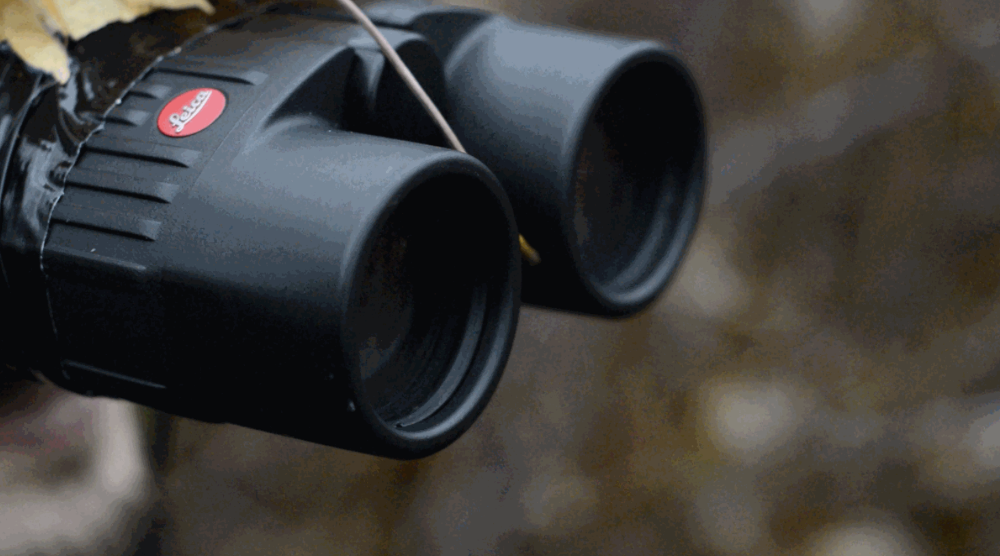

<meta name="google-site-verification" content="tZbMPOjjx5MMYuGdTXja4pkMsHFuJzeIC42ABwwNRfQ" />

<!-- <iframe src="http://kevinegbert.com/kae_sigma/" width="700px" height="300px"></iframe> -->

<!--  -->

  <!--  -->
<!-- 
 
   -->

  <!-- <h1 class="page-heading">Posts</h1>

  <ul class="post-list">
    
      <li>
        {{ post.date | date: "%b %-d, %Y" }}

        <h2>
          <a class="post-link" href="{{ post.url | prepend: site.baseurl }}">{{ post.title }}</a>
        </h2>
      </li>
    
  </ul>
  
subscribe <a href="{{ "/feed.xml" | prepend: site.baseurl }}">via RSS</a>
 -->

<!-- <blockquote>
  
A sample blockquote.

  <blockquote>
      
Nested blockquotes are
  also possible.

    </blockquote> -->

<!--  party time  -->

  <body>

<!--  -->
<link href="css/styles.css" rel="stylesheet" />

 

<a href="https://www.w3schools.com">

</a>

<a href="http://localhost:4000/BAM-sound-walk">

</a>

<a href="http://localhost:4000/BAM-sound-walk">

</a>

<a href="http://localhost:4000/BAM-sound-walk">

</a>

  </body>
