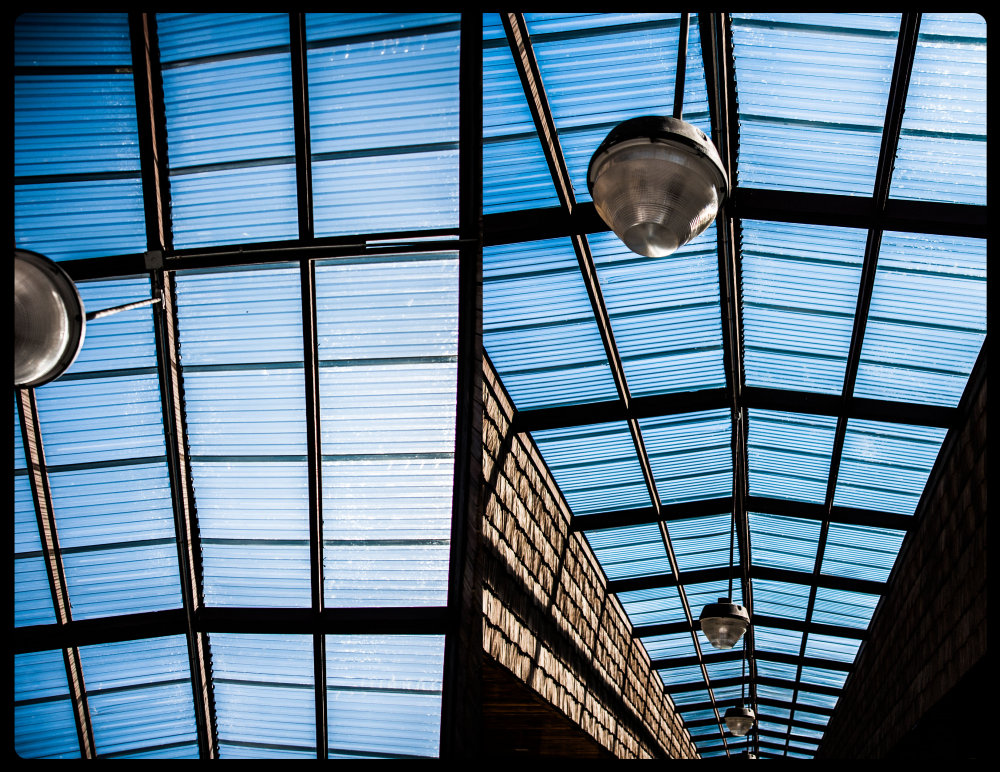

  <body>

<!--  -->
<link href="css/styles.css" rel="stylesheet" />

 

 <a href="http://kevinegbert.com/glass">
 

 </a>

<a href="http://kevinegbert.com/coffee">

</a>

<a href="http://kevinegbert.com/BAM-sound-walk">

</a>
<!--
<a href="http://localhost:4000/BAM-sound-walk">

</a> -->

<a href="http://kevinegbert.com/birdwatching">

</a>

  </body>
