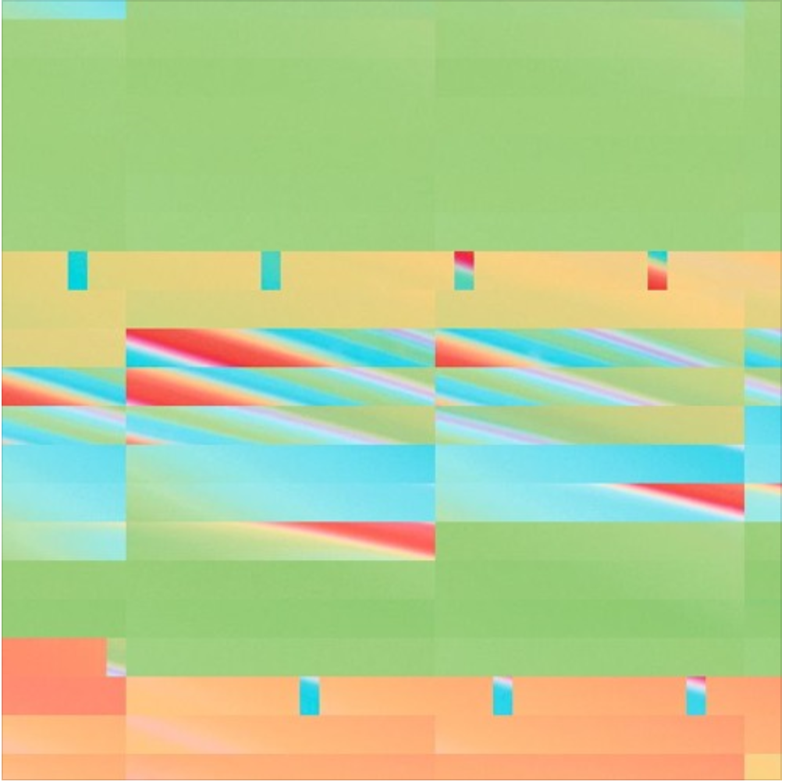
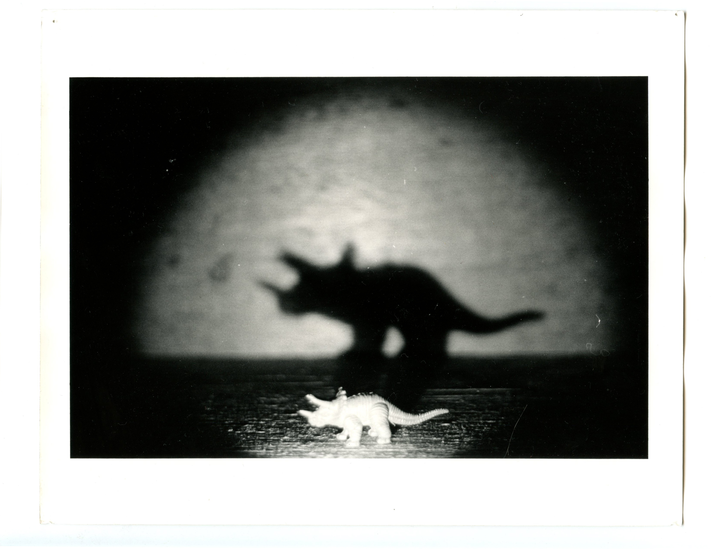
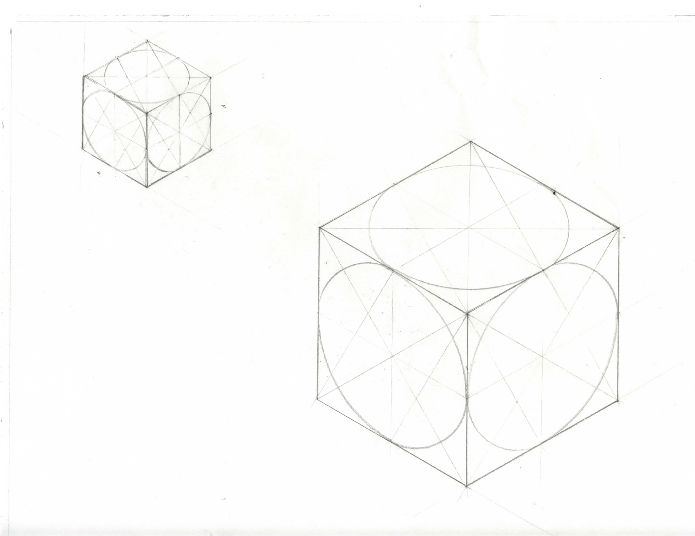

  <body>

  <a href="http://kevinegbert.com/glass">
  

  </a>

<!--  -->
<link href="css/styles.css" rel="stylesheet" />

 

<a href="http://kevinegbert.com/coffee">

</a>

<a href="http://kevinegbert.com/BAM-sound-walk">

</a>
<!--
<a href="http://localhost:4000/BAM-sound-walk">

</a> -->

<a href="http://kevinegbert.com/immersive-birdwatching">

</a>

<a href="http://kevinegbert.com/rye">

</a>

<a href="http://kevinegbert.com/tsm">

</a>

<a href="http://kevinegbert.com/sifaka">

</a>

<a href="http://kevinegbert.com/just-like-you-imagined">

</a>

<a href="http://kevinegbert.com/isometric">

</a>

<a href="http://kevinegbert.com/tv">

</a>

  </body>
